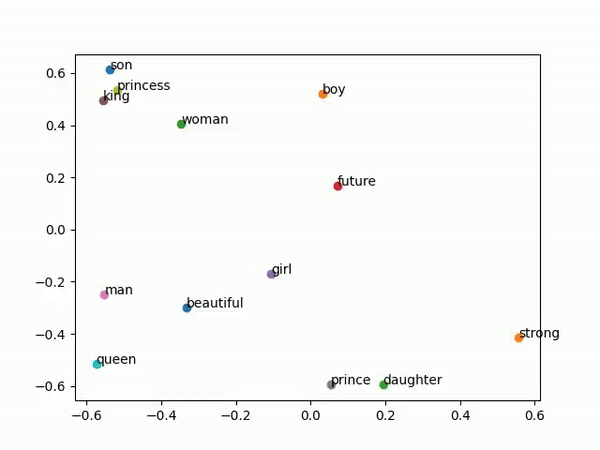

# WordVectorInMotion
A real-time video demonstration of how word embeddings are trained, visually displaying how meaning emerges and changes.

WordVectorInMotion is a unique visualization tool that demonstrates how word embeddings are trained and evolve over time. By visualizing the semantic relationships between words, the tool provides a captivating view of how similar words move closer together as they gain meaning during the training process, while dissimilar words drift apart. The tool generates a video showcasing this transformation.

## Features
* Dynamic Visualization: Watch word embeddings evolve as the training progresses, with similar words converging.
* Semantic Relationships: Visualizes how words of similar meanings cluster closer together over time.
* Educational: Great for understanding how word embeddings, such as Word2Vec, GloVe, or Transformer-based embeddings, capture semantic meaning.
* Video Output: Generates a video of the entire training process, allowing users to observe word vectors in motion.

